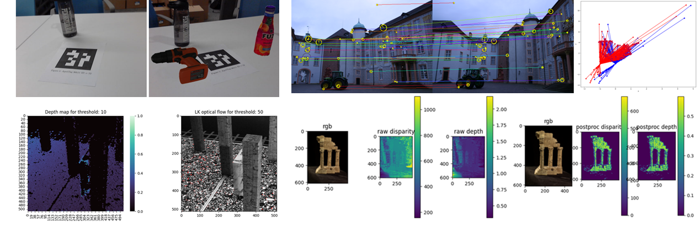
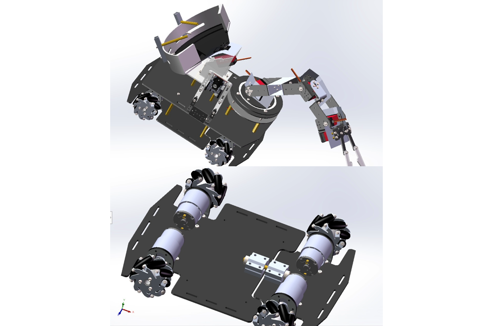

**Differential Wheeled Robot Lidar SLAM in Indoor Environment 2022**  
• Deployed **PRM** and **RRT\*** indoors generating global path in 2.0 second in **Gazebo** simulation environment.  
• Adapted **MPC** controller in dynamic state lattice following the trajectory, visualized by ROS **Rviz**.  
• Implement **EKF** against particle filter as localization and achieve 80% time decrease and higher accuracy.  
• Mapping by **Bresenham's line algorithm** with Lidar and wheel odometry data and corrected by loop closure.  

**2D Path Planning Interface on OpenStreetMap 2022**  
• Implemented **DFS**, **BFS**, **Greedy Best First** compared with A\* planning algorithm on building dense 2D map.  
• Improved **weighted A\*** with diagonal heuristic and cross tie breaker achieving 40 times improvement in sparse grid map.  
• Developed algorithm visualization GUI interface interact with mouse clicking by **JAVA**.

**Information Retrieval (Named Entity Recognition) using Hidden Markov Model 2022**  
• Fitting the **HMM** transition and emission parameters with the train set of 6000 documents on MITMovie Dataset.  
• Implemented **Viterbi** algorithm and Laplace smoothing achieving 98% accuracy on 2000 test documents.

**3D Reconstruction in Augmented Reality Context 2023**  
• Estimated the homography that maps the video images onto the Penn Engineering logo points.  
• Established world coordinate system by AprilTags and solved **PnP** problem mapping objects to 3D view, heavily used **NumPy**.  
• Implemented visual odometry by **optical flow** and visualized the depth map.  
• Utilized **SIFT** matches and **RANSAC** estimated essential matrix to recover the pose and reconstructed 3D scene.  

**National Engineering Practice 2021**  
• Find video [here](https://youtu.be/IHseo0RF8Oc).  
• The result was featured in [the website of MAE department](https://www4.mae.cuhk.edu.hk/newsnawards/silver-award-in-the-national-finals-of-the-2021-china-university-students-engineering-practice-and-innovation-ability-competition/).  

**Grant Theft Autonomous 2023**  
• Find the competition recording at [GRASP Lab Youtube Channel](https://www.youtube.com/watch?v=Pt5Qd4mry5I&t=9516s).  

**Pick and Place Challenge 2023**  
• Find the competition recording at [GRASP Lab Youtube Channel](https://www.youtube.com/watch?v=enAke8V9i44).  

**Stewart Platform Movement 2024**  
• Implemented algorithms to calculate analytical solution for **forward and inverse kinematics**.  
• Built **PID** controller for linear actuators’ velocity feedback control with position sensor.  
• Developing motion planning and trajectory tracking algorithms with desired trajectory recorded by **Vicon** Motion Capture System.  

