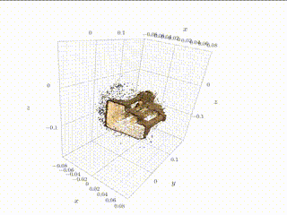
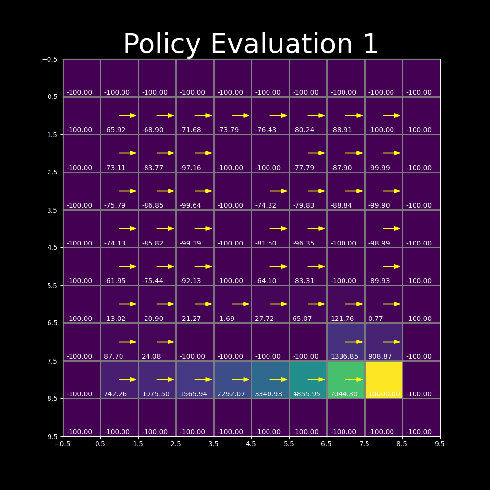
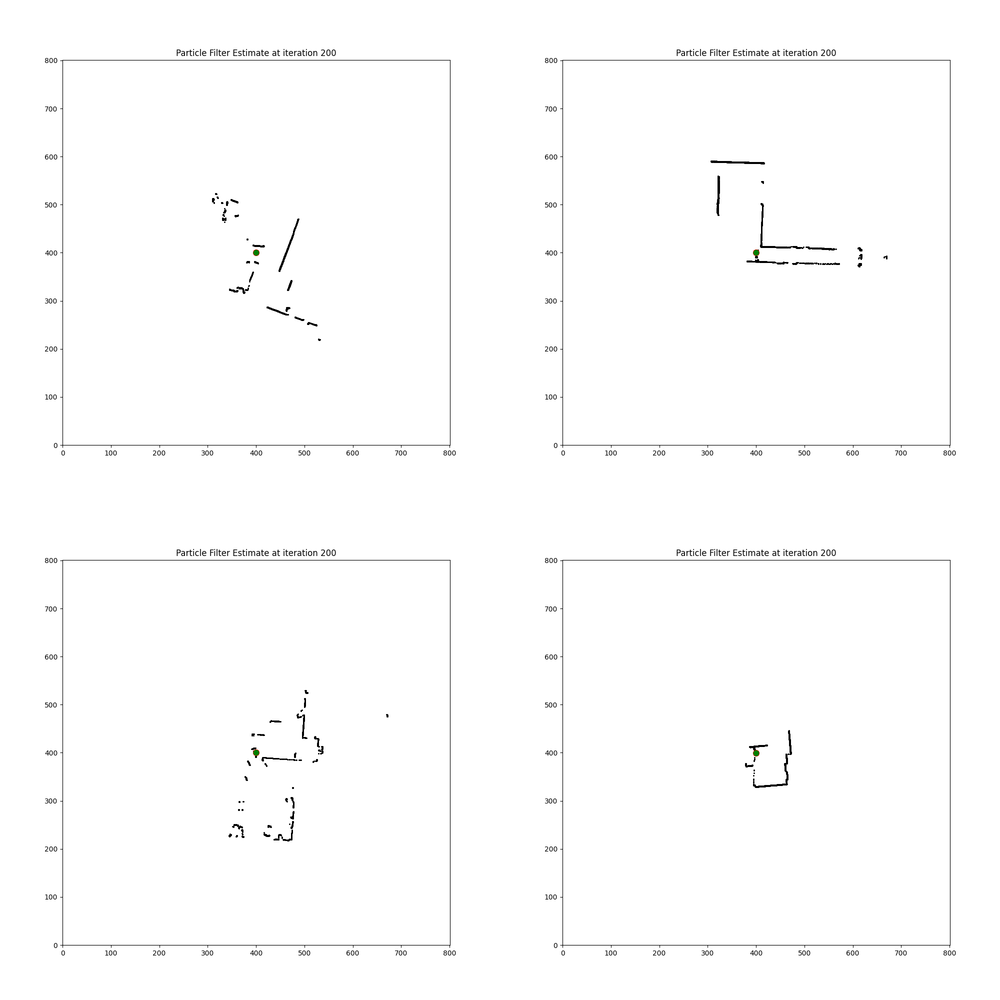

## Integrated System

<table class="myTable">

  <tr>
    <td width="25%"></td>
    <td>
      <strong>F1tenth Autonomous Racing Car 2024</strong>     
      This project is based on <a href="https://f1tenth.org/index.html">F1tenth</a>, an open-source platform for small-scale autonomous driving. I implemented the full stack of the algorithm, and I am preparing for the upcoming <a href="https://icra2024-race.f1tenth.org/">15th F1tenth Autonomous Grand Prix on IEEE ICRA 2024</a>. (The video is at 1.0x speed).  
      Pipeline: 
      1. SLAM: Based on ROS2, I build the map with SLAM toolbox and particle filter and refined it with OpenCV.  
      2. Planning: I defined a global path given by dynamic-aware optimization. Then I implemented a RRT* as local path planning.  
      3. Control: I used a PID controller first and then switched to MPC.  
      <strong>What's different from other candidates' projects:</strong>  
      4. I implemented a <u>safety layer</u> to avoid collision with other vehicles and pedestrians.  
      5. I deployed reactive control layer to increase the car speed <u>3x faster in simple environments</u>.   
      6. I improved the RRT* with <strong>bias sampling, sample rejection, graph sparsify, delay collision check</strong> and Python computation tricks to <u>decrease the runtime cost by 80%</u>.  
    </td>
  </tr>

  <tr>
    <td width="25%"></td>
    <td>
      <strong>Quadrotor’s Planning and Control 2024 </strong>     
      This project realized the state estimation, planning, trajectory optimization, and control of a quadrotor from scratch.  
      <strong>What's different from other candidates' projects:</strong>  
      1. State estimation: I implemented <strong>quaternion-based</strong> UKF and complementary filter, which <u>increase 20% efficiency</u> compared with rotation matrices implementation. Because of the computational resource limit, I deployed complementary filter on the onboard IMU.  
      2. Path planning: A* is used, as well as engineering tricks, like <strong>diagonal heuristic and cross tie breaker</strong>. I am achieving <u>20x planning speed improvement</u> in 3D grid map. Further improvement includes integrating dynamic model with state-space planning, such as State Lattice Search, Kinodynamic RRT*, Hybrid A* , etc..   
      3. Trajectory optimization: a kinodynamic constrained planning algorithm is essentially solving with boundary constrain in the Cartesian space. I implemented <strong>minimum snap</strong> trajectory optimization algorithms based on path that A* gives.   
    </td>
  </tr>

  <tr>
    <td width="25%"></td>
    <td>
      <strong>Pick and Place Challenge 2023</strong> 
      The project is aim at pick the static and dynamic blocks and stack them. I led my team to win the <u>first place</u> with excellent and stable algorithms. Find the competition recording at <a href="https://www.youtube.com/watch?v=enAke8V9i44">here</a>. 
      <strong>What's different from other candidates' projects:</strong>  
      1. It has a robust pose matching algorithm: i.e., it is always desired that the end effector grabs the block in a certain pose (always with the camera facing forward) <u>even with large error in the pose estimation</u>.  
      2. Trajectory planning: I used <strong>RRT* + offline interpolation + velocity profile planning + lookup table speedup</strong>, while other candidates used hardcode position. <u>My method doubled the speed</u>.  
    </td>
  </tr>

</table>

## Perception

<table class="myTable">

  <tr>
    <td width="25%"></td>
    <td>
      <strong>Mono ORB Visual Odometry 2023</strong> 
      A minimum python version mono visual odometry.  
      Pipeline:  
      1. Frame Processing: Converts each frame to grayscale to simplify and expedite subsequent feature detection and matching steps. 
      2. Feature Extraction and Matching: Leverages ORB for efficient feature detection and FLANN with LSH for fast, accurate feature matching, optimizing the identification of corresponding points across frames. 
      3. Motion Estimation: Uses RANSAC for robust Essential Matrix estimation to derive precise rotation and translation matrices, filtering outliers and ensuring reliable motion estimation. 
      4. Pose Update: Updates camera pose using calculated motion vectors, generating precise projection matrices for depth estimation and 3D reconstruction. 
      5. Triangulation: Triangulates matching points between successive frames to reconstruct 3D scene geometry, utilizing the camera's intrinsic parameters and updated poses for spatial reconstruction. 
      • Further improvement can be on G2O pose optimization, database maintainance, and multi-threading for faster processing. 
    </td>
  </tr>

  <tr>
    <td></td>
    <td>
    <strong>Stereo Vision 2023</strong> 
      Reconstructe the objects from stereo camera data.  
      Pipeline:  
      1. Rectification: Implemented camera rectification using rotation matrices and homography to align stereo images for accurate depth mapping. 
      2. Disparity Mapping: Engineered algorithms to calculate disparity maps from stereo images, utilizing SSD, SAD, and ZNCC metrics for pixel comparison. 
      3. Point Cloud: Converted disparity maps into depth maps, then back-projected to create precise 3D point clouds of the scene. 
      4. Visualization: Utilized K3D and Plotly libraries for real-time visualization of 3D reconstructions, facilitating immediate analytical insights. 
    </td>
  </tr>

  <tr>
    <td></td>
    <td>
    <strong>NeRF 2023</strong> 
      A implementation of NeRF (Neural Radiance Field) by PyTorch for rendering novel views of objects. 
    </td>
  </tr>

  <tr>
    <td></td>
    <td>
      <strong>Augmented Reality 2023</strong> 
      I rendered the virtual objects of the drill and the bottle in a video by first estimating the camera pose using the info on the AprilTag, using either P3P (3-point correspondence) or PnP (n-point correspondence) approach from scratch (nonOpenCV implementation). 
    </td>
  </tr>

</table>

## Decision

<table class="myTable">

  <tr>
    <td width="25%"></td>
    <td>
    <strong>Policy Iteration Planning 2022</strong> 
      The robot moving in grid map with obstacles and rewards. We can find the optimal trajectory by using policy iteration algorithm. In every step, we update the cost/reward and policy of the robot.  
      The robot can move in four directions (north, east, west, and south) with some stochasticity. The goal is to maximize the expected discounted reward over an infinite time horizon. 
      By iterating enough times, we can find the optimal policy that maximizes the expected discounted reward in every place to guide the movement.  
    </td>
  </tr>

</table>

## SLAM

<table class="myTable">

  <tr>
    <td width="25%"></td>
    <td>
    <strong>Humanoid Robot SLAM 2023</strong> 
      I implement particle filter SLAM in an indoor environment using information from an IMU and a LiDAR sensor. The data is collected from a humanoid robot named THOR built at Penn and UCLA. Find a video about the robot <a href="https://www.youtube.com/watch?v=JhWYYuba1nE">here</a>. The goal is to estimate the robot's pose and build an occupancy grid map of the surroundings.
    </td>
  </tr>

  <tr>
    <td></td>
    <td>
      <strong>Differential Wheeled Robot Lidar SLAM in Indoor Environment 2022</strong> 
      • Deployed <strong>PRM</strong> and <strong>RRT*</strong> indoors generating global path in 2.0 second in <strong>Gazebo</strong> simulation environment. 
      • Adapted <strong>MPC</strong> controller in dynamic state lattice following the trajectory, visualized by ROS <strong>Rviz</strong>. 
      • Implement <strong>EKF</strong> against particle filter as localization and achieve 80% time decrease and higher accuracy. 
    </td>
  </tr>

</table>

## Planning

<table class="myTable">

  <tr>
    <td width="25%"></td>
    <td>
      <strong>2D Path Planning Interface on OpenStreetMap 2022</strong> 
      • Implemented <strong>DFS</strong>, <strong>BFS</strong>, <strong>Greedy Best First</strong> compared with A* planning algorithm on building dense 2D map. 
      • Improved <strong>weighted A*</strong> setting cost function based on real-time traffic and road conditions.  
      • Developed algorithm visualization GUI interface interact with mouse clicking by <strong>JAVA</strong>. 
    </td>
  </tr>
</table>

## Control and Hardware

<table class="myTable">

  <tr>
    <td width="25%"></td>
    <td>
      <strong>6-DoF Stewart Platform 2024</strong>     
      Supervised by Prof. Mark Yim, the director of GRASP Lab.
        
      • Developed a set of <strong>self-calibration algorithms</strong> for it to ensure the accuracy of motion control. 
      • Built <strong>PD</strong> position controller for linear actuators’ velocity feedback control with position sensor. 
      • Developed and trajectory tracking and <strong>polynomial interpolation</strong> with desired trajectory recorded by <strong>Vicon</strong> Motion Capture System. 
      • Find the code <a href="https://github.com/Hao-Starrr/Stewart-Platform">here</a>. 
    </td>
  </tr>

  <tr>
    <td></td>
    <td>
      <strong>National Engineering Practice 2021</strong> 
      <u>National Silver Prize</u> amongst over two hundred universities.  
      In this project, we've custom-built a logistics cart from the ground up. It's designed to automatically detect the color of objects and adeptly place them in their designated spots on the shelves.  
      After implementing an array of sophisticated control strategies for tracking and precise positioning, we discovered that a finely-tuned hard-coded speed control, especially after refining the curve trajectories, offered the most reliable performance. This experience underscored a valuable lesson: complexity isn't inherently superior; adaptability and tailoring solutions to meet specific demands are crucial. Our approach paid off handsomely.  
      • Find video <a href="https://youtu.be/IHseo0RF8Oc">here</a>. 
      • The result was featured in <a href="https://www4.mae.cuhk.edu.hk/newsnawards/silver-award-in-the-national-finals-of-the-2021-china-university-students-engineering-practice-and-innovation-ability-competition/">the website of MAE department</a>. 
    </td>
  </tr>

  <tr>
    <td></td>
    <td>
      <strong>Grant Theft Autonomous 2023</strong> 
      In this competition I also led my team to win the <u>first place</u>.  
      1. Designed a unique robot mechanical structure, circuit structure. And  designed a number of functional modules that can be mounted on to the robot based on the modularization design idea and the principle of expandable; 
      2. In terms of control, the motor control circuit is designed and the PID speed control algorithm is implemented to achieve a good dynamic tracking effect on the speed profile; 
      3. Using TOF, photoresistor as the main sensing tool and Vive system as the main localization tool, based on which we realized the functions of roving wall, capturing special frequency light source signals and automatically navigating to the source, and automatic grasping; 
      4. Using I2C, UART and other wired data transmission methods to transmit sensor data, adopts ESP's unique end-to-end communication protocol ESP-NOW to communicate between multiple control boards, and uses UDP and TCP/IP to broadcast its own coordinates and status information. 
      5. Created a Webpage using html and HTTP communication to teleoperate the robot manually. 
      • Find the competition recording at <a href="https://www.youtube.com/watch?v=Pt5Qd4mry5I&t=9516s">GRASP Lab Youtube Channel</a>. 
    </td>
  </tr>

  <tr>
    <td></td>
    <td>
      <strong>Waldo (remote manipulator) 2023</strong> 
      It is a low-cost waldo device that shows a minimum function of remote manipulator. The main structure is 3D printed. I use a potentiometer as input, filtered the signal and output the PWM signal to control the SG90 servo. The input device DOF is the same as the output DOF, which avoids the inverse kinematics calculation.   
      • I am hoping to build a larger system with advanced algorithms and functions like <a href="https://mobile-aloha.github.io/">Mobile ALOHA</a> or <a href="https://github.com/peng-zhihui/Dummy-Robot?tab=readme-ov-file#dummy-robot-super-compact-smart-robotic-arm">Dummy-Robot by Zhihui</a>. If your company are interested in one of these projects, please contact me. 
    </td>
  </tr>

</table>
