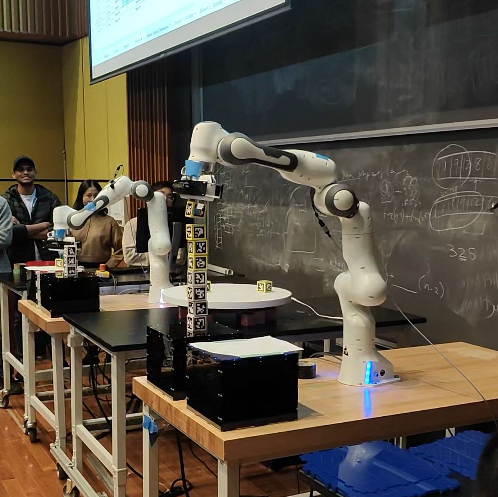
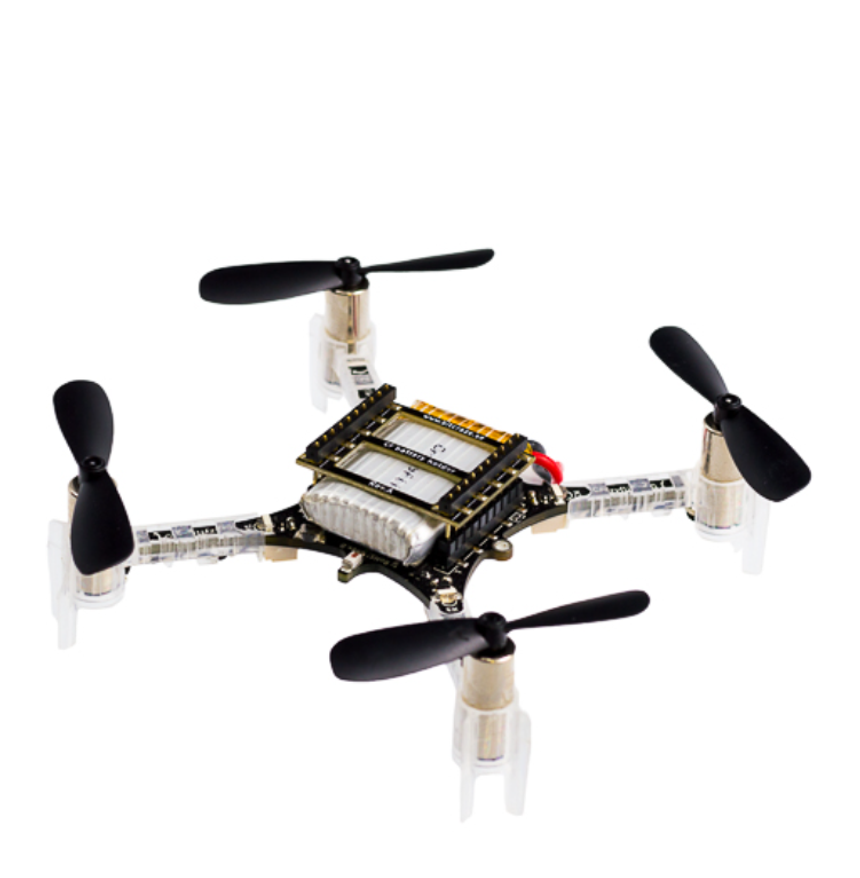
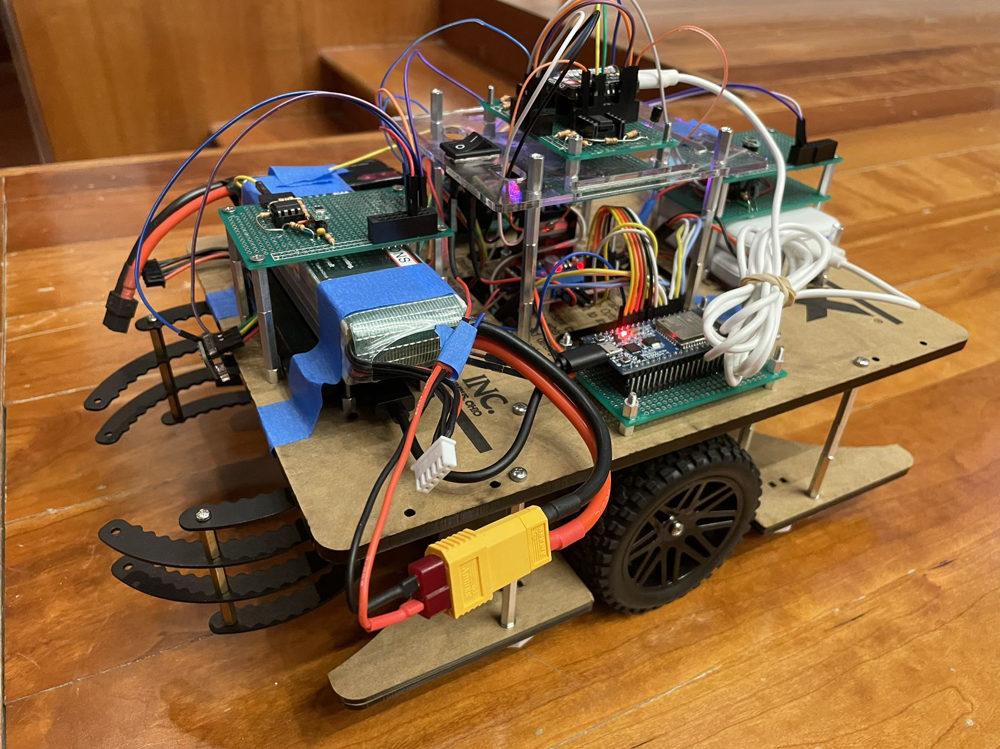
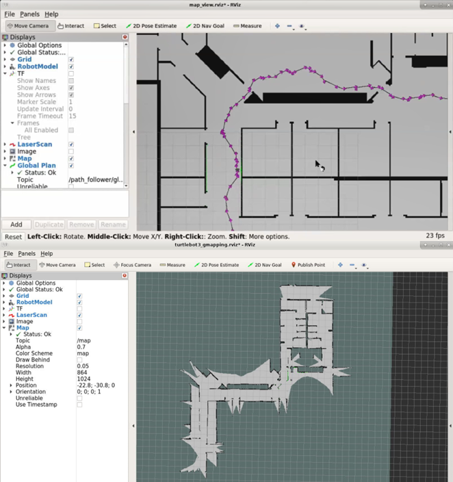
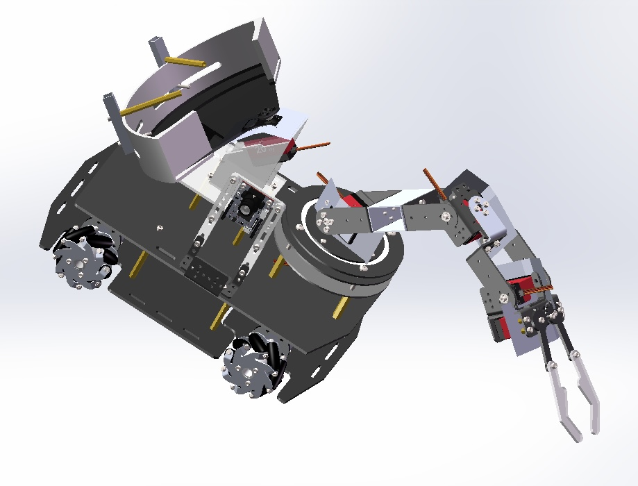
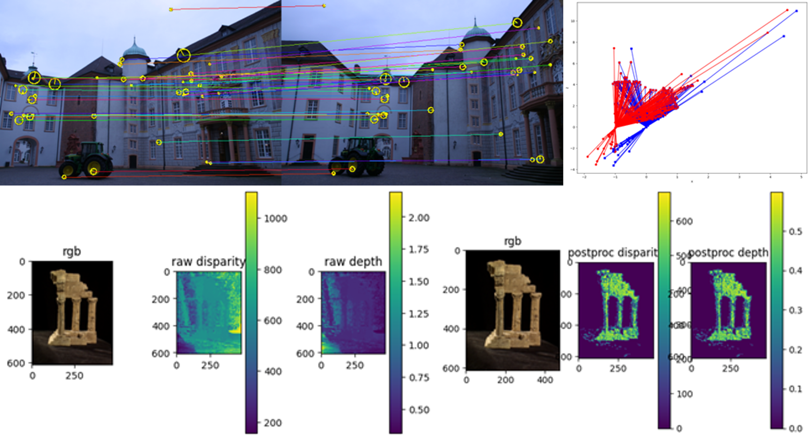
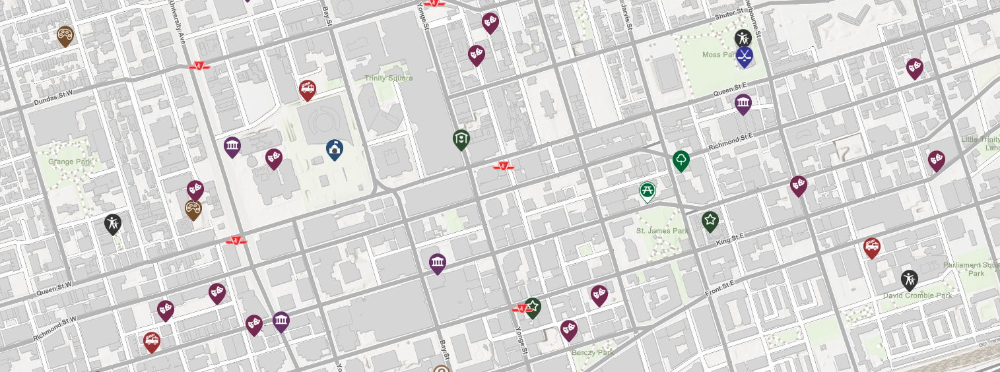
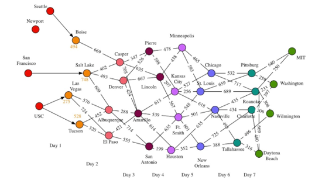

## Manipulators and Teleoperation

<table class="myTable">

 <tr>
    <td width="25%"></td>
    <td>
      <strong>VR Teleop Robot Arm 2024 </strong>     
      I set out to control robots in the most intuitive and natural way imaginable, hence the development of this system. We leverage the cameras on the VR headset to capture the movements of human hands, instantly feeding this data into the ROS system. From there, retargeting algorithms take the VR, dictating the robot's movements. Through the VR headset, operators are immersed in the robot's viewpoint, enabling them to provide the most natural and human-like feedback control. Our gesture recognition technology is powered by Ultraleap, while the retargeting algorithm was initially crafted in Python before being meticulously converted to C++ for real-time control. 
    </td>

  </tr>

  <tr>
    <td width="25%"></td>
    <td>
      <strong>6-DoF Stewart Platform 2024</strong>     
      Supervised by Prof. Mark Yim, the director of GRASP Lab.
        
      • Developed a set of <strong>self-calibration algorithms</strong> for it to ensure the accuracy of motion control. 
      • Built <strong>PD</strong> position controller for linear actuators’ velocity feedback control with position sensor. 
      • Developed and trajectory tracking and <strong>polynomial interpolation</strong> with desired trajectory recorded by <strong>Vicon</strong> Motion Capture System. 
      • Find the code <a href="https://github.com/Hao-Starrr/Stewart-Platform">here</a>. 
    </td>
  </tr>

  <tr>
    <td></td>
    <td>
      <strong>Waldo (remote manipulator) 2023</strong> 
      It is a low-cost waldo device that shows a minimum function of remote manipulator. The main structure is 3D printed. I use a potentiometer as input, filtered the signal and output the PWM signal to control the SG90 servo. The input device DOF is the same as the output DOF, which avoids the inverse kinematics calculation.   
      I am hoping to build a larger system with advanced algorithm and functions like <a href="https://mobile-aloha.github.io/">Mobile ALOHA</a> or <a href="https://github.com/peng-zhihui/Dummy-Robot?tab=readme-ov-file#dummy-robot-super-compact-smart-robotic-arm">Dummy-Robot by Zhihui</a>. If your company are interested in one of these projects, please contact me. 
    </td>
  </tr>

  <tr>
    <td></td>
    <td>
      <strong>Pick and Place Challenge 2023</strong> 
      I led my team to win the first place with excellent and stable algorithms, and the attached video captures the winning moment. The project used the following techniques: 
      1. solve the position of an object in the world coordinate system based on the graphic coding information detected by the camera and the rigid-body transformation law; 
      2. a pose matching algorithm: i.e., it is always desired that the end effector grabs the wooden block in a certain pose (always with the camera facing forward); 
      3. trajectory planning algorithm: the RRT* algorithm is used for trajectory planning in Cartesian space, and the obstacle avoidance algorithm is specially developed for the robotic arm gripper jaws; 
      4. inverse kinematics solving and velocity tracking: numerical optimization is used to solve the inverse kinematics for the position and velocity of each path point on the trajectory; 
      • Find the competition recording at <a href="https://www.youtube.com/watch?v=enAke8V9i44">GRASP Lab Youtube Channel</a>. 
    </td>
  </tr>
  
  <tr>
    <td></td>
    <td>
      <strong>3D Reconstruction in Augmented Reality Context - Part2 2023</strong> 
      • Estimated the homography that maps the video images onto the Penn Engineering logo points. 
      • Established world coordinate system by AprilTags and solved <strong>PnP</strong> problem mapping objects to 3D view. 
    </td>
  </tr>
</table>

## Mobile Robots

<table class="myTable">

  <tr>
    <td width="25%"></td>
    <td>
      <strong>F1tenth Autonomous Racing Car 2024 (In Progress)</strong>     
      <a href="https://f1tenth.org/index.html">F1tenth</a> is an open-source platform for small-scale autonomous driving, which has long been widely used in teaching and researching autonomous driving-related and autonomous mobile robots, and there have been numerous international events related to it, such as the upcoming <a href="https://icra2024-race.f1tenth.org/">15th F1tenth Autonomous Grand Prix on IEEE ICRA 2024</a>.  
      I am currently under the tutelage of professor Rahul Mangharam, learning and practicing the various techniques on the autopilot pipeline, including: 
      - ROS2 Frame work 
      - Advanced control theory 
      - Different techniques for localization (SLAM) 
      - Different techniques for the fast and secure path planning 
      - Different methods for detection an object 
      - Sensor fusion 
      - The deployment of software on real hardware and GPU acceleration for machine learning algorithms 
      - SIL and HIL tests 
    </td>
  </tr>

  <tr>
    <td width="25%"></td>
    <td>
      <strong>Quadrotor’s Planning and Control 2024 </strong>     
      This project mainly focus on kinodynamic constrained planning and control algorithms of quadrotors.   
      1. As for path planning, a kinodynamic constrained planning algorithm is essentially solving with boundary constrain in the Cartesian space. I implemented <strong>minimum snap</strong> trajectory optimization algorithms based on path that A* gives.   
      2. By applying engineering tricks, such as <strong>diagonal heuristic and cross tie breaker</strong>, I am achieving 20x planning speed improvement in 3D grid map. Further improvement includes integrating dynamic model with state-space planning, such as <strong>State Lattice Search, Kinodynamic RRT*, Hybrid A*</strong> , etc..   
      3. As for control algorithms, in order to adapt more easily to physical constraints and to adapt to rapidly changing environments and tasks, compared with Model-Based Controllers, we consider <strong>geometrically nonlinear controllers</strong>.  
      4. As for state estimation, I used <strong>quaternion-based UKF</strong> to estimate the state of the quadrotor, which includes orientation and angular velocity.  
      5. At the hardware level, the CrazyFlie 2.1 was used for realistic demonstrations. A microcomputer is responsible for low-level control and estimation, while the onboard IMU provides feedback of angular velocities and accelerations. The attitude and thrust commands are sent to the quadrotor  after being computed in python. To evaluate the trajectory of the quadrotor, we may use a Vicon Motion Capture System to record feedback pose data.
    </td>
  </tr>

  <tr>
    <td></td>
    <td>
      <strong>Grant Theft Autonomous 2023</strong> 
      In this competition I also led my team to win the first place. The attached video captures the winning moment. The project used the following techniques: 
      1. Designed a unique robot mechanical structure, circuit structure. And  designed a number of functional modules that can be mounted on to the robot based on the modularization design idea and the principle of expandable; 
      2. In terms of control, the motor control circuit is designed and the PID speed control algorithm is implemented to achieve a good dynamic tracking effect on the speed profile; 
      3. Using TOF, photoresistor as the main sensing tool and Vive system as the main localization tool, based on which we realized the functions of roving wall, capturing special frequency light source signals and automatically navigating to the source, and automatic grasping; 
      4. Using I2C, UART and other wired data transmission methods to transmit sensor data, adopts ESP's unique end-to-end communication protocol ESP-NOW to communicate between multiple control boards, and uses UDP and TCP/IP to broadcast its own coordinates and status information. 
      5. Created a Webpage using html and HTTP communication to teleoperate the robot manually. 
      • Find the competition recording at <a href="https://www.youtube.com/watch?v=Pt5Qd4mry5I&t=9516s">GRASP Lab Youtube Channel</a>. 
    </td>
  </tr>

  <tr>
    <td></td>
    <td>
      <strong>Differential Wheeled Robot Lidar SLAM in Indoor Environment 2022</strong> 
      • Deployed <strong>PRM</strong> and <strong>RRT*</strong> indoors generating global path in 2.0 second in <strong>Gazebo</strong> simulation environment. 
      • Adapted <strong>MPC</strong> controller in dynamic state lattice following the trajectory, visualized by ROS <strong>Rviz</strong>. 
      • Implement <strong>EKF</strong> against particle filter as localization and achieve 80% time decrease and higher accuracy. 
      • Mapping by <strong>Bresenham's line algorithm</strong> with Lidar and wheel odometry data and corrected by loop closure. 
    </td>
  </tr>

  <tr>
    <td></td>
    <td>
      <strong>National Engineering Practice 2021</strong> 
      In this project, we've custom-built a logistics cart from the ground up. It's designed to automatically detect the color of materials and adeptly place them in their designated spots on the shelves.  
      • Find video <a href="https://youtu.be/IHseo0RF8Oc">here</a>. 
      After implementing an array of sophisticated control strategies for tracking and precise positioning, we discovered that a finely-tuned hard-coded speed control, especially after refining the curve trajectories, offered the most reliable performance. This experience underscored a valuable lesson: complexity isn't inherently superior; adaptability and tailoring solutions to meet specific demands are crucial. Our approach paid off handsomely as we clinched the silver award in the national competition, standing out amongst over two hundred universities. 
      • The result was featured in <a href="https://www4.mae.cuhk.edu.hk/newsnawards/silver-award-in-the-national-finals-of-the-2021-china-university-students-engineering-practice-and-innovation-ability-competition/">the website of MAE department</a>. 
    </td>
  </tr>
  
</table>

## Perception and Planning Algorithms

<table class="myTable">

  <tr>
    <td width="25%">
    </td>
    <td>
      <strong>3D Reconstruction in Augmented Reality Context - Part1 2023</strong> 
      • Implemented visual odometry by <strong>optical flow</strong> and visualized the depth map. 
      • Utilized <strong>SIFT</strong> matches and <strong>RANSAC</strong> estimated essential matrix to recover the pose and reconstructed 3D scene. 
    </td>
  </tr>

  <tr>
    <td></td>
    <td>
      <strong>2D Path Planning Interface on OpenStreetMap 2022</strong> 
      • Implemented <strong>DFS</strong>, <strong>BFS</strong>, <strong>Greedy Best First</strong> compared with A* planning algorithm on building dense 2D map. 
      • Improved <strong>weighted A*</strong> setting cost function based on real-time traffic and road conditions.  
      • Developed algorithm visualization GUI interface interact with mouse clicking by <strong>JAVA</strong>. 
    </td>
  </tr>

  <tr>
    <td></td>
    <td>
      <strong>Information Retrieval (Named Entity Recognition) using Hidden Markov Model 2022</strong> 
      • Fitting the <strong>HMM</strong> transition and emission parameters with the train set of 6000 documents on MITMovie Dataset. 
      • Implemented <strong>Viterbi</strong> algorithm and Laplace smoothing achieving 98% accuracy on 2000 test documents. 
    </td>
  </tr>

</table>
